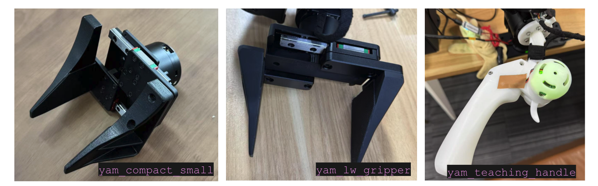

# I2RT Python API

A Python client library for interacting with [I2RT](https://i2rt.com/) products, designed with simplicity and extensibility in mind.

[](https://i2rt.com/)
## Features

- Plug and play python interface for I2RT robots
- Real-time robot control via CAN bus communication
- Support for directly communicating with motor (DM series motors)
- Visualization and gravity compensation using MuJoCo physics engine
- Gripper force control mode and auto calibration

## Installation

```bash
conda create --name i2rt_env python=3.10
cd ~/i2rt
pip install -e .
```

## Basic CAN Usage
Plug in the CAN device and run the following command to check the available CAN devices.
```bash
ls -l /sys/class/net/can*
```

This should give you something like this
```bash
lrwxrwxrwx 1 root root 0 Jul 15 14:35 /sys/class/net/can0 -> ../../devices/platform/soc/your_can_device/can0
```

Where can0 is the CAN device name.

You need to bring up the CAN interface with
```bash
sudo ip link set can0 up type can bitrate 1000000
```

We have provided a convenience script to reset all CAN devices. Simply run
```bash
sh scripts/reset_all_can.sh
```

### See [set_persist_id_socket_can.md](doc/set_persist_id_socket_can.md) if you want to set persistent CAN device names

## Gripper type

Currently YAM supports three different grippers: 


| Gripper Name        | Description |
|---------------------|-------------|
| `yam_compact_small` | Zero-linkage crank gripper, optimized for minimizing gripper width. |
| `yam_lw_gripper`    | Linear gripper with smaller DM3507 motor. Lightweight, but requires calibration or starting with the gripper in the closed configuration. |
| `yam_teaching_handle` | Used for the leader arm setup. Includes a trigger to control the gripper and two customizable buttons that can be mapped to different functions. |

The linear gripper requires an additional calibration step because its motor must rotate more than 2π radians to complete the full stroke.

## Run YAM Gello Leader Follower (foot pedal controls gripper)

Doesn't work over ssh and make sure the following command returns x11.
```bash
echo $XDG_SESSION_TYPE
```

Terminal 1: Launch follower robot
```bash
conda activate i2rt_env
cd ~/i2rt
python scripts/minimum_gello.py --gripper yam_compact_small --mode follower --can-channel can0 --bilateral_kp 0.2
```

Terminal 2: Launch leader robot
```bash
python scripts/minimum_gello.py --gripper yam_compact_small --mode leader --can-channel can1 --bilateral_kp 0.2
```

## Contributing
We welcome contributions! Please make a PR.

## License
This project is licensed under the MIT License - see the [LICENSE](LICENSE) file for details.

## Support
- Contact: support@i2rt.com

## Acknowledgments
- [TidyBot++](https://github.com/jimmyyhwu/tidybot2) - Flow base hardware and code is inspired by TidyBot++
- [GELLO](https://github.com/wuphilipp/gello_software) - Robot arm teleop is inspired by GELLO
